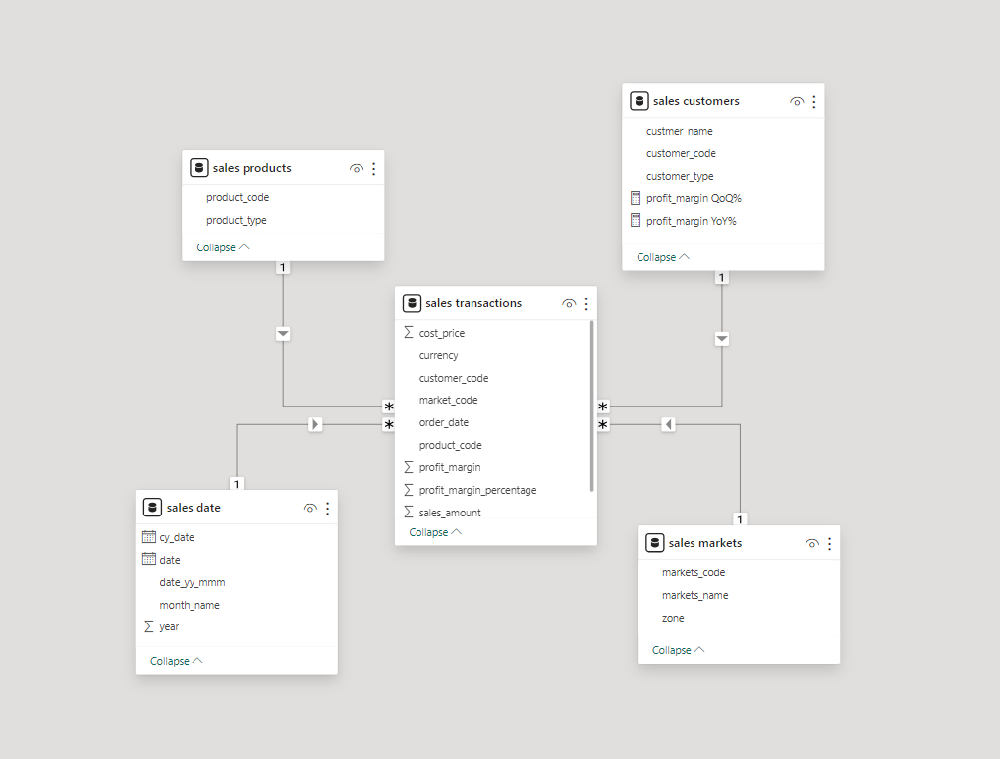
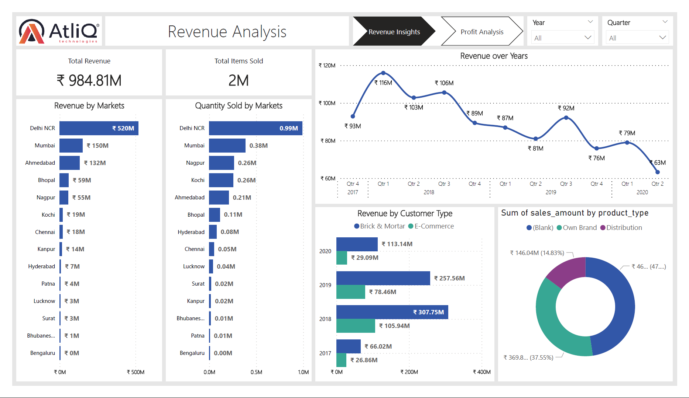
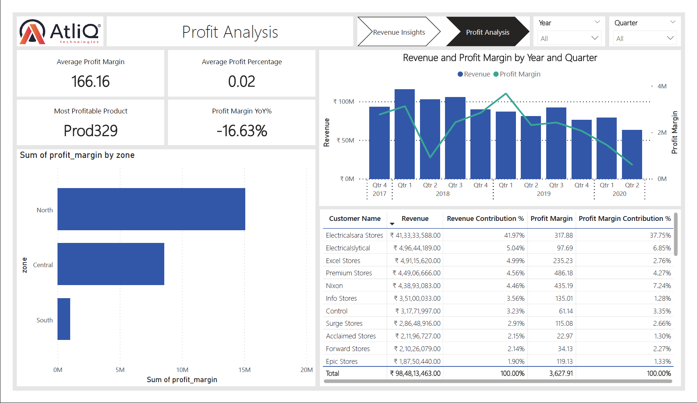

# AtliQ-Hardware-Sales-Analysis

## About the Company
- AtliQ hardware is a company which supplies computer hardware and computer peripherals to clients across India.

## Problem Statement:
- The sales director of Atliq Hardware is facing challenges in tracking sales in a dynamically growing market. 

- The sales director does not have a direct access to track down the performance of the business. Atliq has regional managers in north, south and central regions to monitor business in their respective region. These regional managers responsibility includes communicating the performance of the business to the sales director.

- So, the sales directors receives updates on monthly basis which he finds incomplete, inadeqaute, limited, and insubstantial in terms of numbers. This is concerning for the sales director as the sales in most regions are declining and he is not able to take data driven decision.

- Following are the specific problems that the sales director is facing:

    1. He is unable to track sales in real time. He only receives sales data on a monthly basis, which is too slow to make timely decisions.
    2. He does not have a clear understanding of how his sales are performing in different regions or product categories.
    3. He is unable to identify trends in his sales data. This makes it difficult for him to predict future sales and make informed decisions about marketing and pricing.

## Data Modelling

1. Imported data from sql file (**db_dump_version_2.sql**) into MySQL database

    |Table Name     |Description    |
    |---            |---            |
    |Customers      |Data of all clients    |
    |Date           |Dates on which business was done   |
    |Products       |Products of the company sold|
    |Markets        |Locations of Cities and Zones  sales   |
    |Transactions   |Contains information about the business done with the client   |

2. Performed EDA on the dataset using SQL alongside Cleaned and Transformed data using SQL.

3. Imported data from MySQL Server into Power BI.

4. The relationship with the 4 dimension tables which are **customers**, **markets**, **products**, date was established with the fact table **transactions** which holds the references (foreign key) from the primary keys of child tables. The relationship being one to many.

## Dashboard

## References:
[Sales insights Power BI project by Codebasics](https://www.youtube.com/watch?v=hhZ62IlTxYs&list=PLeo1K3hjS3uva8pk1FI3iK9kCOKQdz1I9)